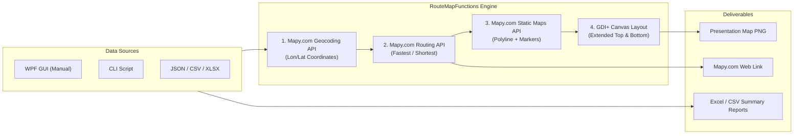

# Mapy.com Routes & Map Generator v2.1

An enterprise-grade, universal PowerShell and WPF application for multi-stop vehicle route calculation, multi-criteria optimization (**Fastest**, **Shortest**), and presentation-ready PNG map generation powered by the **[Mapy.com REST API](https://developer.mapy.com/rest-api-mapy-cz/)** (Routing API, Geocoding API, and Static Maps API).

---


## Key Features

### 1. Multi-Stop Route Optimization (Mapy.com Routing API)
- **Origin & Destination**: Geocoded with regional structure resolution, postal code, and rooftop accuracy.
- **Waypoints**: Up to 15 intermediate stops with interactive reordering (Move Up / Move Down).
- **Leg-by-Leg Metrics**: Queries Mapy.com Routing API to capture exact distances and travel times between consecutive stops.
- **Optimization Modes**:
  - ⚡ **Fastest (`Fastest`)**: Minimizes travel time (`car_fast` or optional live traffic awareness `car_fast_traffic`).
  - 📏 **Shortest (`Shortest`)**: Minimizes physical distance (`car_short`).
  - 🚫 **Avoid Options**: Native support for avoiding toll roads (`avoidToll`) and highways (`avoidHighways`).

### 2. Zero-Occlusion Extended Map Canvas (GDI+) & Overlay Customizer
- **No Map Overlays**: Unlike standard static map tools that stamp text over map tiles, our custom GDI+ rendering engine **extends the canvas vertically**:
  - **Top Banner**: Route title/name on the left, localized route type badge (`Typ: Najkrótsza`, `Type: Shortest`) on the right.
  - **Unobstructed Map**: 100% visible Mapy.com map tiles with full road geometry, markers (`A`, `1..N`, `B`), and encoded polyline. Max static resolution: 1024×1024.
  - **Bottom Banner**: Origin [A] in green, Destination [B] in red, with total distance and duration positioned so multi-line wrapped addresses never collide with metrics.
- **Point Distances in Address Annotations**:
  - Enabling the **Point Distances** (`PointDistances` / `Dystanse między punktami`) overlay option appends individual leg distances directly in parentheses to waypoint addresses and the destination address:
    - `1: Marszałkowska 10, Warszawa (+14.5 km)`
    - `2: Warszawska 5, Łomianki (+8.2 km)`
    - `B: Sportowa 5, Nowy Dwór Mazowiecki (+22.8 km)`
  - Operates as a clean address decorator (default panel: `None`) without adding unnecessary clutter to the banner layout.
- **Fully Customizable Overlays**: Configure visibility, panel placement (Top, Bottom, None), text alignment (Left, Center, Right), and line order for all route metadata elements.

### 3. Multi-Language Support (EN / DE / PL) & External Schema
- **Dynamic UI Localization**: Switch between **English**, **Deutsch**, and **Polski** at runtime via the header dropdown (`[PL] Polski`).
- **External Configuration (`localization.json`)**: Add new languages without modifying source code or recompiling.
- **Mapy.com API Integration**: API requests pass the selected language (`lang=pl`), ensuring map labels, exonyms, and street names match the chosen locale.

### 4. Universal Batch Processing & Route Name Support
- **Automatic Route Name Detection**: Automatically reads route names from tabular source files:
  - Header variations recognized: `Route Name`, `Nazwa Trasy`, `RouteName`, `Nazwa`, `Umowa`, `Opis`, `Name`.
  - In multi-point routes where stops span multiple consecutive rows, the route name in the first row is automatically inherited across all stops.
  - Route names are displayed in the batch overview DataGrid (`dgBatchOverview`) and are **fully editable** prior to execution.
  - The custom route name is rendered in the PNG map header and included in the output filename (`YYYYMMDD_HHMMSS_route_X_<cleanRouteName>.png`).
- **File Format Support**:
  - **Excel (.xlsx)**: Processes tabular route files automatically.
  - **CSV / TSV**: Automatic delimiter detection (semicolon, comma, tab).
  - **JSON**: Supports both flat route lists and multi-point grouped trips.
- **Points Detail View**: View detailed leg distances (`LegDistanceKm`) and travel durations (`LegDurationMin`) for every stop in the batch.
- **Comprehensive Exports**:
  - Summary and detailed Excel reports (`.xlsx`) with dedicated `PunktyTrasy` worksheet.
  - Points CSV export (`*_punkty.csv`) with full leg distance and duration metrics.
  - JSON, HTML interactive leaflet reports, GPX, KML, and PDF summary dossiers.
- **Smart Folder Memory**: Remembers last-opened directory and output paths across sessions.

### 5. Production Security & Standalone Compilation
- **Windows DPAPI Credential Protection**: API keys are securely encrypted using Windows DPAPI (`DataProtectionScope.CurrentUser`) and stored in `config.json`.
- **Standalone Windows Executable**: Compile into a single, standalone executable (`MapyComRoutes.exe`) using `Build-Exe.ps1` (powered by PS2EXE). Runs in Single-Threaded Apartment (`-STA`) without console windows (`-NoConsole`).

---

## Architecture



---

## Requirements

- **Operating System**: Windows 10 / Windows 11 / Windows Server 2016+
- **PowerShell**: Windows PowerShell 5.1 or PowerShell 7+ (Core)
- **PowerShell Modules**:
  - `ImportExcel` (required for Excel `.xlsx` processing)
  - `ps2exe` (optional, for compiling `.exe` executables)
- **Mapy.com API Key**:
  - Obtain from [developer.mapy.com](https://developer.mapy.com/rest-api-mapy-cz/)
  - Store via UI Settings, DPAPI config, or environment variable: `MAPY_COM_API_KEY` (or `MAPY_API_KEY`)

---

## Quick Start

### Graphical User Interface (GUI)
Run the script directly:
```powershell
# Run PowerShell script:
.\MapyComRoutes-GUI.ps1

# Or run backward-compatible wrapper:
.\GoogleMapsRoutes-GUI.ps1
```

#### Manual Route Calculation:
1. Enter **Origin (A)** and **Destination (B)** addresses.
2. (Optional) Add intermediate stops in the **Waypoints** list and organize them using ▲/▼.
3. Select route optimization: **Fastest** or **Shortest**.
4. Click **🚀 CALCULATE ROUTE & DOWNLOAD MAP**.
5. View real-time distance, travel time, and the rendered map. Use **🗺️ Mapy.com** to open the route in your browser.

#### Batch File Processing:
1. Switch to the **📁 Batch File Processing** tab.
2. Click **📂 Browse File...** and select a `.json`, `.csv`, or `.xlsx` file (see `.\Samples`).
3. Verify or edit the **Route Name** column and route parameters in the DataGrid preview.
4. Click **▶ Start Processing**.
5. Review leg distances and travel times in the **Points Detail** grid. Generated PNG maps and summary reports are saved to your configured output folder.

---

## Command Line Interface (CLI)

For headless automation, CI/CD, or batch script pipelines, use `Invoke-MapyComRoute.ps1`:

### 1. Manual Route with Intermediate Stops
```powershell
.\Invoke-MapyComRoute.ps1 `
    -StartPoint "Warszawa, Plac Defilad 1" `
    -EndPoint "Kraków, Rynek Główny 1" `
    -Waypoints "Radom, Plac Konstytucji 1", "Kielce, Sienkiewicza 1" `
    -RouteType Fastest `
    -GenerateMap `
    -OpenBrowser
```

### 2. Distance-Minimizing Shortest Route
```powershell
.\Invoke-MapyComRoute.ps1 `
    -StartPoint "Gdańsk, Długa 1" `
    -EndPoint "Toruń, Rynek Staromiejski 1" `
    -RouteType Shortest `
    -GenerateMap
```

### 3. Batch File Processing
```powershell
.\Invoke-MapyComRoute.ps1 `
    -InputFile ".\Samples\routes_sample.xlsx" `
    -ExportFormat All `
    -OutputFolder ".\Results"
```

---

## Compilation to Standalone Executable (.EXE)

The project includes an automated PS2EXE compilation script: [`Build-Exe.ps1`](file:///D:/Skrypty/GoogleMapsRoutes%20%E2%80%94%20kopia/Build-Exe.ps1).

```powershell
# Compile universal MapyComRoutes.exe:
.\Build-Exe.ps1 -Target MapyComRoutes

# Compile dedicated SchoolTransportRoutes.exe:
.\Build-Exe.ps1 -Target SchoolTransportRoutes
```

---

## Project Structure

| File / Directory | Description |
| :--- | :--- |
| [`MapyComRoutes-GUI.ps1`](file:///D:/Skrypty/GoogleMapsRoutes%20%E2%80%94%20kopia/MapyComRoutes-GUI.ps1) | Primary WPF application entry point (Manual & Batch processing). |
| [`GoogleMapsRoutes-GUI.ps1`](file:///D:/Skrypty/GoogleMapsRoutes%20%E2%80%94%20kopia/GoogleMapsRoutes-GUI.ps1) | Backwards-compatible launch redirect to `MapyComRoutes-GUI.ps1`. |
| [`RouteMapFunctions.ps1`](file:///D:/Skrypty/GoogleMapsRoutes%20%E2%80%94%20kopia/RouteMapFunctions.ps1) | Core engine module (Mapy.com Geocoding, Routing, Static Maps, GPX/KML, GDI+ canvas). |
| [`Invoke-MapyComRoute.ps1`](file:///D:/Skrypty/GoogleMapsRoutes%20%E2%80%94%20kopia/Invoke-MapyComRoute.ps1) | Full-featured CLI automation and pipeline script. |
| [`Invoke-GoogleMapsRoute.ps1`](file:///D:/Skrypty/GoogleMapsRoutes%20%E2%80%94%20kopia/Invoke-GoogleMapsRoute.ps1) | Backwards-compatible CLI wrapper redirecting to `Invoke-MapyComRoute.ps1`. |
| [`Build-Exe.ps1`](file:///D:/Skrypty/GoogleMapsRoutes%20%E2%80%94%20kopia/Build-Exe.ps1) | PS2EXE build script for compiling standalone executables. |
| [`localization.json`](file:///D:/Skrypty/GoogleMapsRoutes%20%E2%80%94%20kopia/localization.json) | External multi-language dictionary (English, Deutsch, Polski). |
| [`Modules/AppConfig.ps1`](file:///D:/Skrypty/GoogleMapsRoutes%20%E2%80%94%20kopia/Modules/AppConfig.ps1) | App configuration, overlay preferences, DPAPI credential protection. |
| [`Modules/AppXaml.ps1`](file:///D:/Skrypty/GoogleMapsRoutes%20%E2%80%94%20kopia/Modules/AppXaml.ps1) | Modern WPF XAML layout templates, control bindings, and theme styles. |
| [`Modules/AsyncWorkers.ps1`](file:///D:/Skrypty/GoogleMapsRoutes%20%E2%80%94%20kopia/Modules/AsyncWorkers.ps1) | Background runspaces for asynchronous batch and manual calculation. |
| [`Modules/UiBatchTab.ps1`](file:///D:/Skrypty/GoogleMapsRoutes%20%E2%80%94%20kopia/Modules/UiBatchTab.ps1) | Batch processing controller, DataGrid editing, multi-point grouping, and report dispatch. |
| [`Modules/UiManualTab.ps1`](file:///D:/Skrypty/GoogleMapsRoutes%20%E2%80%94%20kopia/Modules/UiManualTab.ps1) | Manual route tab controller, address search, waypoint ordering, and map preview. |
| [`Modules/UiSettingsTab.ps1`](file:///D:/Skrypty/GoogleMapsRoutes%20%E2%80%94%20kopia/Modules/UiSettingsTab.ps1) | Settings tab controller, API key verification, overlay customizer, theme switching. |
| [`Modules/InteractiveMap.ps1`](file:///D:/Skrypty/GoogleMapsRoutes%20%E2%80%94%20kopia/Modules/InteractiveMap.ps1) | Interactive Leaflet/OSM HTML map rendering and browser viewer. |
| [`Modules/ReportPdf.ps1`](file:///D:/Skrypty/GoogleMapsRoutes%20%E2%80%94%20kopia/Modules/ReportPdf.ps1) | PDF executive dossier generator with embedded route KPI cards and map imagery. |
| [`Process-SchoolTransportRoutes-GUI.ps1`](file:///D:/Skrypty/GoogleMapsRoutes%20%E2%80%94%20kopia/Process-SchoolTransportRoutes-GUI.ps1) | Dedicated school transport contract processing GUI (Mapy.com enabled). |
| [`Process-SchoolTransportRoutes.ps1`](file:///D:/Skrypty/GoogleMapsRoutes%20%E2%80%94%20kopia/Process-SchoolTransportRoutes.ps1) | Dedicated CLI school transport contract processor. |
| [`ImplementMapy.md`](file:///D:/Skrypty/GoogleMapsRoutes%20%E2%80%94%20kopia/ImplementMapy.md) | Technical architecture and implementation migration plan. |

---

## File Encoding Standards

In accordance with project guidelines, all source files (`.ps1`, `.psm1`), configuration files (`.json`), and documentation (`.md`) are strictly encoded in **UTF-8 with BOM** (`0xEF, 0xBB, 0xBF`).
